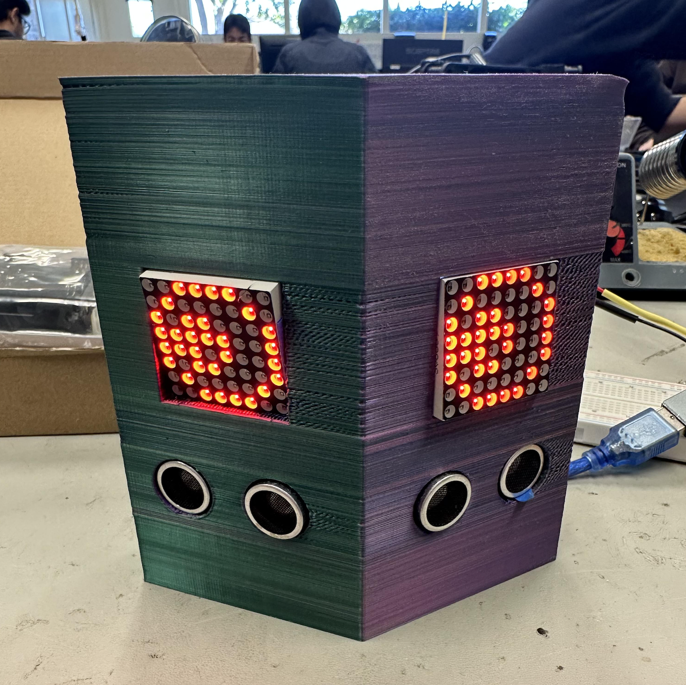
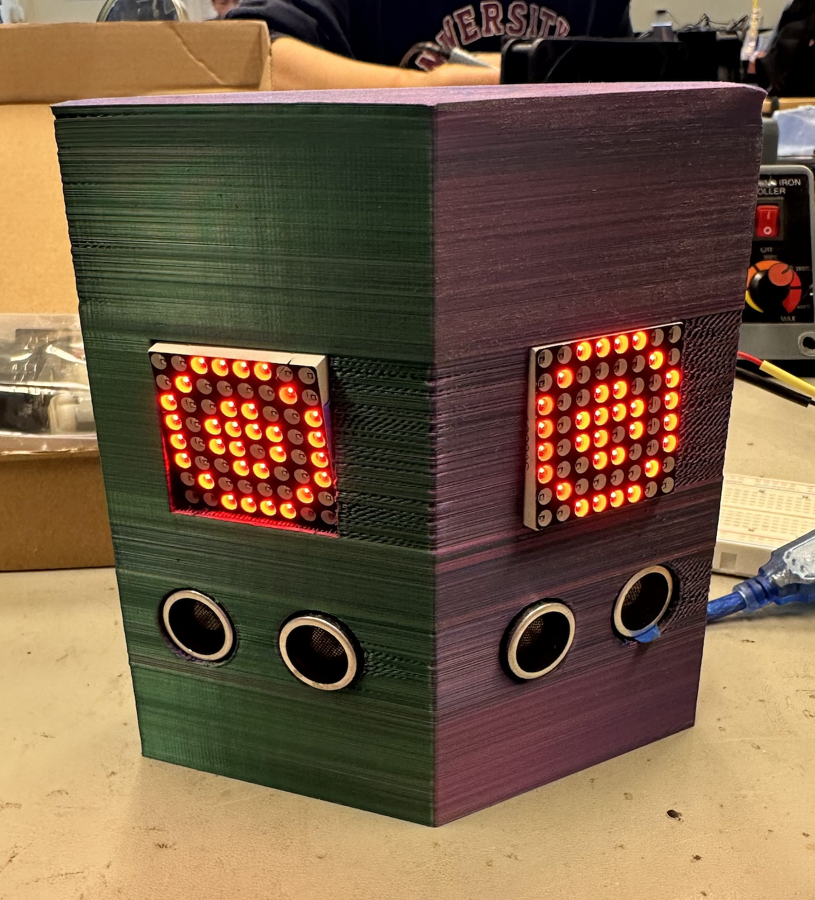
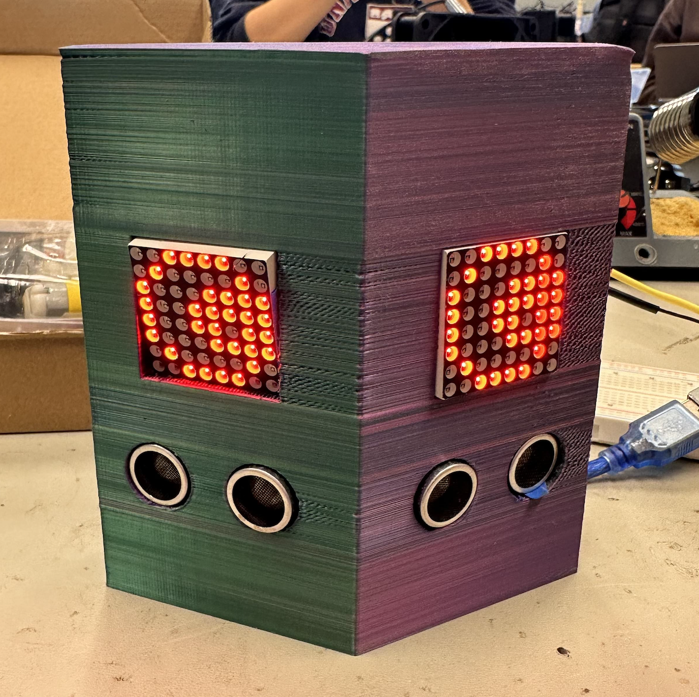

# Ultrasonic Eyes

| **Engineer** | **School** | **Area of Interest** | **Grade** |
|:--:|:--:|:--:|:--:|
| Alexa Z | Crystal Springs Uplands School | Mechanical Engineering | Incoming Sophomore


{:height="50%" width="50%"}
  
# Final Milestone
<iframe width="560" height="315" src="https://www.youtube.com/embed/F7M7imOVGug" title="YouTube video player" frameborder="0" allow="accelerometer; autoplay; clipboard-write; encrypted-media; gyroscope; picture-in-picture; web-share" allowfullscreen></iframe>

# Summary
For my third milestone, i wanted to mount my project onto wheels so it would be able to rotate in the direction of wherever the eyes were looking. To do this, I slapped my entire project onto a chassis and attached wheels and motors to it. It's mobile! And fairly autonomous.
## (new) Components
- DC Motor - a motor that uses a magnetic field and a positive/negative terminal to rotate
### Challenges
The biggest challenges and triumphs I had at bluestamp were mostly related to the LED matrices and the code that made them work. There were a litany of problems with them, from having to resolder the pin headers on them multiple times due to connection issues and then realizing the connection issues were because the original creator included the incorrect voltage for the matrices (3v instead of 5v), to the original code’s libraries not working and me having to look online for a replacement library that i reworked the code with. There were some good moments, though, like displaying things on them for the first time or watching the eyes finally track my movements. Other than that, the biggest triumph I had was completing the project.
## Progress
I mainly learned technical things, such as how to solder properly, basic c++, how to work with motors, and how to maximise space. Other than that, I also learned some details about the components i worked with - how motor drivers and ultrasonic sensors work, led matrices and how they’re powered, and how negative and positive charges influence the rotation of a DC motor. 
## Next Steps
In the future, I hope to use the skills I gained here to make things more convenient in my daily life. Soldering, c++, and a basic understanding of some components means that i could, in theory, make my own projects to remedy some of the inconveniences in my life.

# Second Milestone
<iframe width="560" height="315" src="https://www.youtube.com/embed/1-xwfs6DFRc" title="YouTube video player" frameborder="0" allow="accelerometer; autoplay; clipboard-write; encrypted-media; gyroscope; picture-in-picture; web-share" allowfullscreen></iframe>

## Summary
My second milestone was to get my base project working, which I just did. Now, when I put my hands in front of each ultrasonic sensor, the eyes look the way they’re supposed to. In order to do this, I had to fix the code from the blueprint given to me. To do this, I ended up integrating the code from my last milestone that allowed me to display the eyes into the original code. I also found an easier way to clear the screen, using a specific built-in command rather than defining my own.
### no new components :')
## Challenges
My previous method for clearing the screen (setting a bitmap to be entirely on, defining it as a function and setting the entire thing to LOW) worked in theory. I couldn’t use a bitmap filled entirely with zeroes because the LED bitmaps had an additive effect, resulting in something that looked like an animation with onion skin layers. My method resulted in specific pixels lagging behind the rest, refusing to turn on, and flickering, so it wasn’t ideal. While looking through the example projects from one of the libraries I was using, however, I found a “fillScreen” command that let me clear things by setting every single LED to low. This allowed me to properly animate everything, instead of the previous eye sprite staying on the screen without being overwritten by the next one.
Some previous challenges I overcame were the eyes not displaying properly and my code being  cluttered. With my new libraries, I was able to make the eyes work as well as define all the important parts of my code as functions so I could call them more easily.
## Progress
I basically completed my base project - everything works.
## Next steps
Before I complete my final milestone, I will need to figure out how I’m going to mount the whole thing onto the chassis. Right now, the box is relatively thin, so I might need to 3d-print a wider box so it doesn’t fall over or become unstable while it’s moving. I’ll also need to solder everything onto a protoboard so it’s more compact and easier to fit inside the box, then fit the ultrasonic sensors and LED matrices into their places securely. Right now, everything’s held together with painter’s tape, which is functional but incredibly irritating to work with.
{:height="30%" width="30%"}
{:height="30%" width="30%"}
{:height="30%" width="30%"}

# First Milestone

<iframe width="560" height="315" src="https://www.youtube.com/embed/fn8rEQxJKiU" title="YouTube video player" frameborder="0" allow="accelerometer; autoplay; clipboard-write; encrypted-media; gyroscope; picture-in-picture; web-share" allowfullscreen></iframe>

## Summary
My project is the Ultrasonic Eyes, which track movement based on ultrasonic sensors and display eyes that follow said movement. The components include two LED matrices, two ultrasonic sensors, and an Arduino Nano.
### Components
- LED matrices: a form of dot-matrix display, with their cathodes joined in rows and anodes in columns. By sending signals to a specific row and column, you can light up individual LEDS.
- ultrasonic sensors: use ultrasonic waves to calculate distance based on how long it takes for the waves to bounce back (like sonar)
- arduino nano: microcontroller to read code (input) and turn it into an output (turning things on)
Here, I used the LED matrices to light up the pattern for the eyes. Later, by using different “sprites”, I hope that it’ll give the illusion of looking where movement is. The ultrasonic sensors are used to figure out what’s moving - if one of the ultrasonic sensors has a distance value that is more than 0 (and greater than the other’s value), then something’s moving more in front of that sensor and the eyes should look in that direction. Later, I'll use these two together to make the LEDS display eyes that react to the ultrasonic sensor's output The Arduino Nano controls everything with the code I upload to it from my computer, and provides power to the LED matrices so they can turn on. There’s really nothing else about it.
## Progress
Speaking of technical progress, I managed to make the ultrasonic sensors measure distance. I also connected the LED matrices together, had them both display the same thing, and scrolled text across them. This means that the components work separately. I just have to connect them.
## Challenges
I mainly had hardware issues, as the LED matrices have some connection problems that cause each one to turn off sporadically. I don’t know why that is, but it could be because of my soldering. One challenge that I did manage to fix was the flickering of the LEDs, as the blueprint I’m following wrote that they required 3.3 volts when they needed 5. I only managed to realize this after looking up the LED matrix model on Amazon.
## Next Steps
To complete the project, I need to have the eyes react to movement (basically get the project to work). Then, I need to solder my components onto an actual board, mount it inside the 3d-printed box, put it on a chassis to attach wheels to it, and give it the ability to back away from obstacles in its path. Simple, really.

# Starter Project
<iframe width="560" height="315" src="https://www.youtube.com/embed/rF_A1ypClEk" title="YouTube video player" frameborder="0" allow="accelerometer; autoplay; clipboard-write; encrypted-media; gyroscope; picture-in-picture; web-share" allowfullscreen></iframe>

## Summary
This lamp, stylized like a cat, is the exact opposite of the pinnacle of engineering. Sporting a grand total of 7 components (a photoresistor, 100k resistor, transistor, battery, battery holder, LED, and on/off switch), 24 solder joints, and one function, this project demonstrates nothing but my absolute inexperience with engineering. My biggest takeaway from this was my absolute ineptitude. Other than that, I figured out how to solder properly, so it wasn't a total waste.
### Components
- photoresistor: changes its resistance based on how much light there is. under bright conditions, its resistance decreases, and under dark conditions its resistance increases drastically.
- transistor: acts as a switch or gate for electronic signals
- resistor: controls the current coming from the battery
- battery: provides electric current to the project
  Generally, the electricity from the battery goes through the resistor. From there, it can either go through the transistor or photoresistor. When it’s bright, the current prefers going through the photoresistor due to its weak resistance. This means that the amount of current going through the photoresistor increases, and not enough electricity gets to the transistor to turn it on. When it’s dark, the photoresistor’s resistance is maximized. Because of this, the current going through the photoresistor decreases, and therefore the current going to the transistor increases. Enough electricity flows through the transistor’s collector and base legs to turn on the LED.
## Challenges Faced
  The main challenge I had with this project was my inexperience with soldering. I kept on forgetting to heat the metal itself, not just the solder, which made the solder not stick to the surfaces it needed to and prevented the flow of electricity throughout the project. In order to remedy this problem, I now pay close attention to how hot the materials I work with are when I solder.

{:height="30%" width="30%"}
{:height="30%" width="30%"}

# Schematics 
Here's where you'll put images of your schematics. [Tinkercad](https://www.tinkercad.com/blog/official-guide-to-tinkercad-circuits) and [Fritzing](https://fritzing.org/learning/) are both great resoruces to create professional schematic diagrams, though BSE recommends Tinkercad becuase it can be done easily and for free in the browser. 

# Code
Here's where you'll put your code. The syntax below places it into a block of code. Follow the guide [here]([url](https://www.markdownguide.org/extended-syntax/)) to learn how to customize it to your project needs. 

```c++
#include <SPI.h>
#include <Adafruit_GFX.h>
#include <Max72xxPanel.h>

int pinCS = 10;

//establishes ultrasonic sensors
const int trigPin = 2;
const int echoPin = 3;
const int trigPin2 = 4;
const int echoPin2 = 5;
//one duration/distance for each sensor
long duration;
long duration2;
int distance1;
int distance2;
int dist1;
int dist2;

int numberOfHorizontalDisplays = 1;
int numberOfVerticalDisplays = 1;
Max72xxPanel matrix = Max72xxPanel(pinCS, numberOfHorizontalDisplays, numberOfVerticalDisplays);

//eyesprites
const unsigned char PROGMEM eyeforward[] = {
  B00111100,
  B01000010,
  B10011001,
  B10101101,
  B10111101,
  B10011001,
  B01000010,
  B00111100
};

const unsigned char PROGMEM eyeright[] = {
  B00111100,
  B01000010,
  B11110001,
  B11011001,
  B11111001,
  B11110001,
  B01000010,
  B00111100
};

const unsigned char PROGMEM eyeleft[] = {
  B00111100,
  B01000010,
  B10001101,
  B10010111,
  B10011111,
  B10001101,
  B01000010,
  B00111100
};

const unsigned char PROGMEM eyeblink[] = {
  B00000000,
  B00000000,
  B00000000,
  B00000000,
  B10000001,
  B01000010,
  B00111100,
  B00000000
};

// We track the current state of the system with this integer variable, this way after a blink, we can out the eyes back to looking at the last direction they were in
// Possible states are:
// 0: Looking forward
// 1: Looking Right
// 2: Looking Left
int currentState = -1; 

void setup()
{

  matrix.setIntensity(10);
  pinMode(trigPin, OUTPUT); //setup for distance
  pinMode(echoPin, INPUT); //we strive for biblical accuracy
  pinMode(trigPin2, OUTPUT);
  pinMode(echoPin2, INPUT);
  Serial.begin(9600); // Starts the serial communication

}

void loop()
{
  dist1 = righteyeping();
  delay(100);
  dist2 = lefteyeping();
  Serial.println(dist1);
  Serial.println(dist2);


  // delay(250); 
  // showeyeforward();
  // delay(250);
  // matrix.fillScreen(LOW);
  // showeyeright();
  // matrix.fillScreen(LOW);


  //  We need to work out if the difference between the distances of each ultrasonic sensors detected item is less than 15
  // or if both distances are 0, meaning nothing was detected. If this condition is met, then make the eyes look forward 
  float difference = ( dist2 - dist1 );
  if ( abs( difference ) < 7 || (dist1 == 0 && dist2 == 0 ) )
  {
    Serial.println("forward");
    delay(250);
    matrix.fillScreen(LOW);
    showeyeforward();
    // currentState = 0;
  }
  // Now if distance1 is greater than distance2 and distance1 is also greater than 0, then we want to look right  
  else if ( dist2 < dist1 && dist1 > 0)
  {
    Serial.println("right");
    delay(250);
    matrix.fillScreen(LOW); 
    showeyeright();
    // currentState = 1;
  }
  // Now if distance2 is greater than distance1 and distance2 is also greater than 0, then we want to look left  
  else if ( dist1 < dist2 && dist2 > 0 )
  {
    Serial.println("left");
    delay(250);
    matrix.fillScreen(LOW);
    showeyeleft();
    // currentState = 2;
  }
}

//defining the sprite functions
void showeyeforward()
{
  matrix.drawBitmap(0, 0, eyeforward, 8, 8, HIGH);
  matrix.write();
}

void showeyeright()
{
  matrix.drawBitmap(0, 0, eyeright, 8, 8, HIGH);
  matrix.write();
}

void showeyeleft()
{
  matrix.drawBitmap(0, 0, eyeleft, 8, 8, HIGH);
  matrix.write();
}

void showeyeblink()
{
  matrix.drawBitmap(0, 0, eyeblink, 8, 8, HIGH);
  matrix.write();
}

void eyeclear()
{
  matrix.drawBitmap(0, 0, clear, 8, 8, HIGH);
  matrix.write();
}

int righteyeping()
{
  digitalWrite(trigPin2, LOW);
  delayMicroseconds(2);
  // Sets the trigPin on HIGH state for 10 micro seconds
  digitalWrite(trigPin2, HIGH);
  delayMicroseconds(10);
  digitalWrite(trigPin2, LOW);
  // Reads the echoPin, returns the sound wave travel time in microseconds
  duration2 = pulseIn(echoPin2, HIGH);
  // Calculating the distance
  distance2 = duration2 * 0.034 / 2;
  // Prints the distance on the Serial Monitor
  // Serial.print("Distance2 (right): ");
  // Serial.println(distance2);
  return distance2;
}

int lefteyeping()
{
  digitalWrite(trigPin, LOW);
  delayMicroseconds(2);
  // Sets the trigPin on HIGH state for 10 micro seconds
  digitalWrite(trigPin, HIGH);
  delayMicroseconds(10);
  digitalWrite(trigPin, LOW);
  // Reads the echoPin, returns the sound wave travel time in microseconds
  duration = pulseIn(echoPin, HIGH);
  // Calculating the distance
  distance1 = duration * 0.034 / 2;  
  return distance1;
}
```
# Bill of Materials
| **Part** | **Note** | **Price** | **Link** |
|:--:|:--:|:--:|:--:|
| Ultrasonic Sensor (2x) | To measure distance | $4.50 each | <a href="https://www.sparkfun.com/products/15569"> here :) </a> |
| Arduino Nano | To process code | $23.23 | <a href="https://www.newark.com/arduino/a000005/dev-board-atmega328-arduino-nano/dp/13T9275?"> here! </a> |
| LED Matrix (2x) | To display eyes | $2.00 each | <a href="https://www.amazon.com/MAX7219-Matrix-Display-Module-Control/dp/B09STT6QDV"> here :D </a> |
| Breadboard (half size) | To hold components | $5.05 | <a href="https://www.newark.com/adafruit/64/bread-board-prototype-electronics/dp/53W6131?"> here :] </a> |
| Male-Male Jumper Wires | To connect components | $4.03 | <a href="https://www.amazon.com/Arduino-A000066-ARDUINO-UNO-R3/dp/B008GRTSV6/"> here </a> |
| Female-Male Jumper Wires | To connect components | $4.03 | <a href="https://www.newark.com/adafruit/826/wire-gauge-28awg/dp/88W2802?"> here </a> |
| Female-Female Jumper Wires | To connect components | $2.99 | <a href="https://www.gobilda.com/female-to-female-jumper-wire-multicolor-10cm-length-40-pack/?gclid=CjwKCAjw5MOlBhBTEiwAAJ8e1ltGwNC-D4mh9wg9YiMIbO6rGFY9HcIgsYPzXv81HINFnjm0SOmvohoCs_IQAvD_BwE"> here </a> |
| 9 Volt Battery | To power components | $10.14 (4pcs) | <a href="https://www.amazon.com/Amazon-Basics-Performance-All-Purpose-Batteries/dp/B0774D64LT?th=1"> here :') </a> |
| 1.5 Volt AA Batteries (4x) | To power components | $7.24 (4pcs) | <a href="https://www.amazon.com/AmazonBasics-Volt-Performance-Alkaline-Batteries/dp/B081FGSWTJ/ref=asc_df_B081FGSWTJ/"> here ;D </a> |
| H Bridge Motor Driver | To control motors | $6.99 | <a href="https://www.amazon.com/Qunqi-Controller-Module-Stepper-Arduino/dp/B014KMHSW6/"> here B) </a> |
| Robot Car Chassis Kit | To move the robot around | $7.24 (4pcs) | <a href="https://www.amazon.com/Smart-Chassis-Motors-Encoder-Battery/dp/B01LXY7CM3/"> here !! </a> |

# Other Resources/Examples
One of the best parts about Github is that you can view how other people set up their own work. Here are some past BSE portfolios that are awesome examples. You can view how they set up their portfolio, and you can view their index.md files to understand how they implemented different portfolio components.
- [Example 1](https://trashytuber.github.io/YimingJiaBlueStamp/)
- [Example 2](https://sviatil0.github.io/Sviatoslav_BSE/)
- [Example 3](https://arneshkumar.github.io/arneshbluestamp/)

To watch the BSE tutorial on how to create a portfolio, click here.
