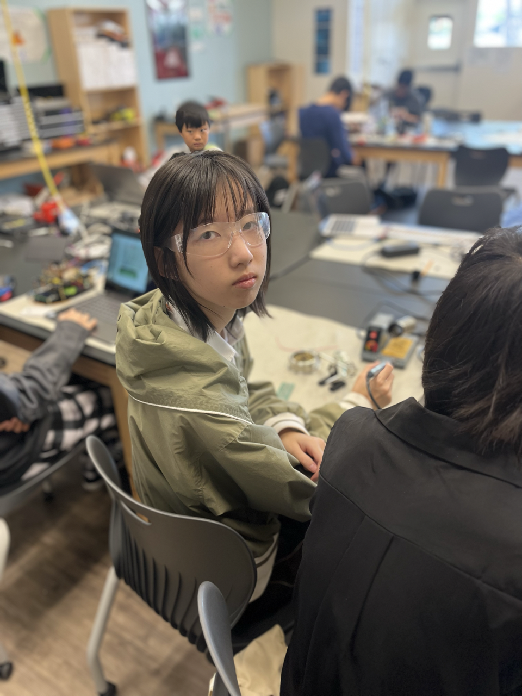
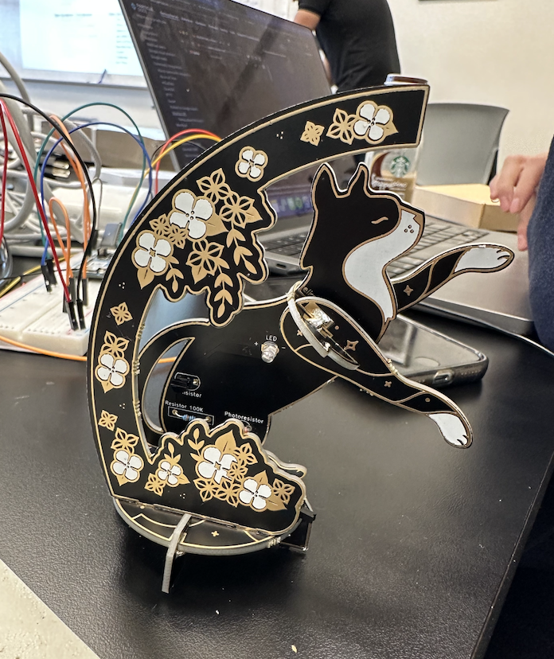
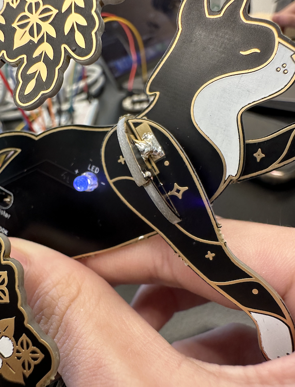

# Ultrasonic Eyes
```HTML ->
welcome to funnyland
```

| **Engineer** | **School** | **Area of Interest** | **Grade** |
|:--:|:--:|:--:|:--:|
| Alexa Z | Crystal Springs Uplands School | Mechanical Engineering | Incoming Junior


{:height="50%" width="50%"}
  
<!--- # Final Milestone

**Don't forget to replace the text below with the embedding for your milestone video. Go to Youtube, click Share -> Embed, and copy and paste the code to replace what's below.**

<iframe width="560" height="315" src="https://www.youtube.com/embed/F7M7imOVGug" title="YouTube video player" frameborder="0" allow="accelerometer; autoplay; clipboard-write; encrypted-media; gyroscope; picture-in-picture; web-share" allowfullscreen></iframe>

For your final milestone, explain the outcome of your project. Key details to include are:
- What you've accomplished since your previous milestone
- What your biggest challenges and triumphs were at BSE
- A summary of key topics you learned about
- What you hope to learn in the future after everything you've learned at BSE


# Second Milestone

**Don't forget to replace the text below with the embedding for your milestone video. Go to Youtube, click Share -> Embed, and copy and paste the code to replace what's below.**

<iframe width="560" height="315" src="https://www.youtube.com/embed/y3VAmNlER5Y" title="YouTube video player" frameborder="0" allow="accelerometer; autoplay; clipboard-write; encrypted-media; gyroscope; picture-in-picture; web-share" allowfullscreen></iframe>

For your second milestone, explain what you've worked on since your previous milestone. You can highlight:
- Technical details of what you've accomplished and how they contribute to the final goal
- What has been surprising about the project so far
- Previous challenges you faced that you overcame
- What needs to be completed before your final milestone 
-->

# First Milestone

<iframe width="560" height="315" src="https://www.youtube.com/embed/fn8rEQxJKiU" title="YouTube video player" frameborder="0" allow="accelerometer; autoplay; clipboard-write; encrypted-media; gyroscope; picture-in-picture; web-share" allowfullscreen></iframe>

My project is the Ultrasonic Eyes, which track movement based on ultrasonic sensors and display eyes that follow said movement. The components include two LED matrices, two ultrasonic sensors, and an Arduino Nano.

The LED matrices are a form of dot-matrix display, with their cathodes joined in rows and anodes in columns. By sending signals to a specific row and column, you can light up individual LEDS. Here, I used this function to light up the pattern for the eyes. Later, by using different “sprites”, I hope that it’ll give the illusion of looking where movement is.

The ultrasonic sensors, as their name suggests, utilize ultrasonic waves to calculate distance much like sonar. By sending out these waves and then measuring the time between when they’re sent out (trigger) and bounced back (echo), you can figure out the distance between the sensor and objects in front of it. Here, they’re used to figure out what’s moving - if one of the ultrasonic sensors has a distance value that is more than 0 (and greater than the other’s value), then something’s moving more in front of that sensor and the eyes should look in that direction.

The Arduino Nano controls everything with the code I upload to it from my computer, and provides power to the LED matrices so they can turn on. There’s really nothing else about it.

Speaking of technical progress, I managed to make the ultrasonic sensors measure distance. I also connected the LED matrices together, had them both display the same thing, and scrolled text across them. I mainly had hardware issues, as the LED matrices have some connection problems that cause each one to turn off sporadically. I don’t know why that is, but it could be because of my soldering. One challenge that I did manage to fix was the flickering of the LEDs, as the blueprint I’m following wrote that they required 3.3 volts when they needed 5. I only managed to realize this after looking up the LED matrix model on Amazon.

To complete the project, I need to have the eyes react to movement (basically get the project to work). Then, I need to solder my components onto an actual board, mount it inside the 3d-printed box, put it on a chassis to attach wheels to it, and give it the ability to back away from obstacles in its path. Simple, really.

# Starter Project
<iframe width="560" height="315" src="https://www.youtube.com/embed/rF_A1ypClEk" title="YouTube video player" frameborder="0" allow="accelerometer; autoplay; clipboard-write; encrypted-media; gyroscope; picture-in-picture; web-share" allowfullscreen></iframe>

This lamp, stylized like a cat, is the exact opposite of the pinnacle of engineering. Sporting a grand total of 7 components (a photoresistor, 100k resistor, transistor, battery, battery holder, LED, and on/off switch), 24 solder joints, and one function, this project demonstrates nothing but my absolute inexperience with engineering. My biggest takeaway from this was my absolute ineptitude. Other than that, I figured out how to solder properly, so it wasn't a total waste.
  
This project mostly relies on the photoresistor. Photoresistors change their resistance based on how much light there is. Under bright conditions, its resistance decreases, and under dark conditions its resistance increases drastically.
Generally, the electricity from the battery goes through the resistor. From there, it can either go through the transistor or photoresistor. When it’s bright, the current prefers going through the photoresistor due to its weak resistance. This means that the amount of current going through the photoresistor increases, and not enough electricity gets to the transistor to turn it on. When it’s dark, the photoresistor’s resistance is maximized. Because of this, the current going through the photoresistor decreases, and therefore the current going to the transistor increases. Enough electricity flows through the transistor’s collector and base legs to turn on the LED.

The main challenge I had with this project was my inexperience with soldering. I kept on forgetting to heat the metal itself, not just the solder, which made the solder not stick to the surfaces it needed to and prevented the flow of electricity throughout the project. In order to remedy this problem, I now pay close attention to how hot the materials I work with are when I solder.

{:height="30%" width="30%"}
{:height="30%" width="30%"}

<!--- # Schematics 
Here's where you'll put images of your schematics. [Tinkercad](https://www.tinkercad.com/blog/official-guide-to-tinkercad-circuits) and [Fritzing](https://fritzing.org/learning/) are both great resoruces to create professional schematic diagrams, though BSE recommends Tinkercad becuase it can be done easily and for free in the browser. 

# Code
Here's where you'll put your code. The syntax below places it into a block of code. Follow the guide [here]([url](https://www.markdownguide.org/extended-syntax/)) to learn how to customize it to your project needs. 

```c++
void setup() {
  // put your setup code here, to run once:
  Serial.begin(9600);
  Serial.println("Hello World!");
}

void loop() {
  // put your main code here, to run repeatedly:

}

# Bill of Materials
Here's where you'll list the parts in your project. To add more rows, just copy and paste the example rows below.
Don't forget to place the link of where to buy each component inside the quotation marks in the corresponding row after href =. Follow the guide [here]([url](https://www.markdownguide.org/extended-syntax/)) to learn how to customize this to your project needs. 

| **Part** | **Note** | **Price** | **Link** |
|:--:|:--:|:--:|:--:|
| Item Name | What the item is used for | $Price | <a href="https://www.amazon.com/Arduino-A000066-ARDUINO-UNO-R3/dp/B008GRTSV6/"> Link </a> |
| Item Name | What the item is used for | $Price | <a href="https://www.amazon.com/Arduino-A000066-ARDUINO-UNO-R3/dp/B008GRTSV6/"> Link </a> |
| Item Name | What the item is used for | $Price | <a href="https://www.amazon.com/Arduino-A000066-ARDUINO-UNO-R3/dp/B008GRTSV6/"> Link </a> |

# Other Resources/Examples
One of the best parts about Github is that you can view how other people set up their own work. Here are some past BSE portfolios that are awesome examples. You can view how they set up their portfolio, and you can view their index.md files to understand how they implemented different portfolio components.
- [Example 1](https://trashytuber.github.io/YimingJiaBlueStamp/)
- [Example 2](https://sviatil0.github.io/Sviatoslav_BSE/)
- [Example 3](https://arneshkumar.github.io/arneshbluestamp/)
-->

To watch the BSE tutorial on how to create a portfolio, click here.
